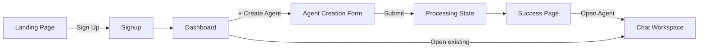

# DESIGN.md — Agent Squared UI Specification

> Generated from Stitch project **"Landing Page"** (ID: `14142564024774077293`)

---

## Design Theme

| Token | Value |
|---|---|
| **Primary Color** | `#3713ec` (deep indigo-violet) |
| **Color Mode** | Light |
| **Font** | Inter (Google Fonts) |
| **Border Radius** | `12px` (`ROUND_TWELVE`) |
| **Saturation** | 2 (high) |
| **Device** | Desktop (1280×1024 base) |

---

## Color Palette

### Primary
| Name | Hex | Usage |
|---|---|---|
| Primary | `#3713ec` | CTA buttons, links, accent highlights |
| Primary Hover | `#2b0fc5` | Button hover states |
| Primary Light | `#ece8fd` | Badges, tag backgrounds, subtle fills |
| Primary Surface | `#f5f3ff` | Section backgrounds, card highlights |

### Neutrals
| Name | Hex | Usage |
|---|---|---|
| Background | `#ffffff` | Page background |
| Surface | `#f8f9fa` | Cards, sidebars, input backgrounds |
| Border | `#e5e7eb` | Dividers, input borders, card borders |
| Text Primary | `#111827` | Headings, body text |
| Text Secondary | `#6b7280` | Descriptions, helper text |
| Text Muted | `#9ca3af` | Timestamps, placeholders |

### Semantic
| Name | Hex | Usage |
|---|---|---|
| Success | `#10b981` | Status badges, check icons |
| Warning | `#f59e0b` | Processing/crawling status |
| Error | `#ef4444` | Error messages, destructive actions |

---

## Typography

| Element | Font | Weight | Size |
|---|---|---|---|
| H1 (Hero) | Inter | 800 (ExtraBold) | 48–56px |
| H2 (Section) | Inter | 700 (Bold) | 32–36px |
| H3 (Card Title) | Inter | 600 (SemiBold) | 20–24px |
| Body | Inter | 400 (Regular) | 16px |
| Small / Caption | Inter | 400 | 14px |
| Button Text | Inter | 600 (SemiBold) | 14–16px |
| Nav Link | Inter | 500 (Medium) | 14px |

---

## Spacing & Layout

| Token | Value |
|---|---|
| Page max-width | `1280px` |
| Section padding | `80px 24px` (vertical, horizontal) |
| Card padding | `24px` |
| Grid gap | `24px` |
| Input height | `44px` |
| Button height | `44px` |
| Border radius (cards) | `12px` |
| Border radius (buttons) | `12px` |
| Border radius (inputs) | `8px` |

---

## Component Library

### Buttons

| Variant | Style |
|---|---|
| **Primary** | `bg: #3713ec`, `color: white`, `border-radius: 12px`, `padding: 12px 24px`, `font-weight: 600` |
| **Secondary** | `bg: transparent`, `border: 1px solid #e5e7eb`, `color: #111827` |
| **Ghost** | `bg: transparent`, `color: #6b7280`, hover: `bg: #f3f4f6` |

### Cards

```
background: #ffffff
border: 1px solid #e5e7eb
border-radius: 12px
padding: 24px
box-shadow: 0 1px 3px rgba(0,0,0,0.05)
```

### Inputs

```
background: #f8f9fa
border: 1px solid #e5e7eb
border-radius: 8px
padding: 12px 16px
font-size: 16px
height: 44px
focus: border-color: #3713ec
```

### Status Badges

| Status | Style |
|---|---|
| Ready | `bg: #ecfdf5`, `color: #10b981`, dot indicator |
| Building/Crawling | `bg: #fffbeb`, `color: #f59e0b` |
| Error | `bg: #fef2f2`, `color: #ef4444` |

### Agent Type Badge
```
background: rgba(55, 19, 236, 0.1)
color: #3713ec
padding: 4px 12px
border-radius: 100px
font-size: 12px
font-weight: 600
```

---

## Screens

### 1. Landing Page
**Dimensions**: 1280 × 3176px (scrollable)

**Sections** (top → bottom):
1. **Navbar** — Logo "Agent²" left, nav links (Features, How it works, Pricing) center, Login + Sign Up buttons right
2. **Hero** — Large heading "Create a company support AI agent in minutes", subtext, CTA button "Get Started Free →"
3. **How It Works** — 3-step horizontal cards: Describe company → Upload knowledge → Get live agent URL
4. **Features Grid** — 3 cards: 24/7 support, Instant answers, No-code setup (with Material icons)
5. **CTA Section** — "Ready to scale your support?" with checklist (unlimited chats, knowledge training, multilingual)
6. **Footer** — Privacy Policy, Terms, Contact links

---

### 2. Agent Creation Flow
**Dimensions**: 1280 × 1161px

**Layout**:
- Back link "← Dashboard" top-left
- Centered form card (`max-width: 560px`)
- Fields: Agent Name, Business Description, Website URL, Forum URL, Support Tone, Key Policies, File Upload zone
- Submit button full-width at bottom

---

### 3. Processing State
**Dimensions**: 1280 × 1024px

**Layout**:
- Fullscreen overlay with centered card
- Animated spinner
- Status text: "Crawling your website…" / "Building your agent…"
- Sub-text: "This may take a moment"

---

### 4. Success & Launch
**Dimensions**: 1280 × 1024px

**Layout**:
- Centered card with success icon (checkmark)
- Agent name + shareable URL
- Copy URL button (primary)
- "Open Agent" button (secondary)

---

### 5. Public Chat Workspace
**Dimensions**: 1280 × 1024px

**Layout**:
- **Header bar**: Agent name + type badge ("💬 Support")
- **Chat area**: Full height, scrollable, greeting message + starter prompt chips
- **Messages**: User (right-aligned, primary bg), Assistant (left-aligned, surface bg), avatar circles
- **Input bar**: Fixed bottom, textarea + send button, "Ask {agent_name} something…" placeholder
- **Thinking indicator**: 3 animated dots in assistant bubble

---

### 6. Business Dashboard
**Dimensions**: 1280 × 1024px

**Layout**:
- **Header bar**: Logo left, company name + logout right
- **Content**: "Your Agents" heading + "+ Create Agent" button
- **Agent list**: Cards with name, type badge, status dot, URL, action buttons (Open, Copy URL)
- **Empty state**: Centered illustration + "Create Support Agent" CTA

---

## User Flow


